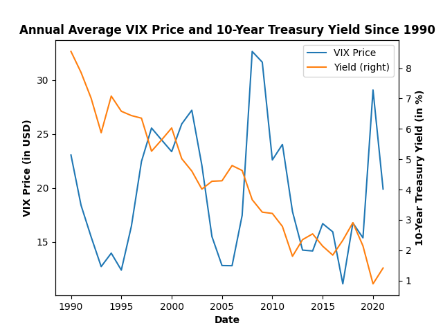
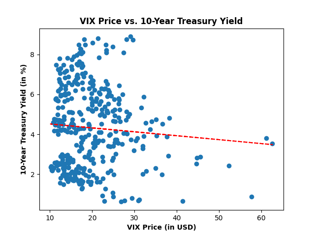

# Predicting 10-Year Treasury Yields

Intitially, I wanted to see if the volatility in the stock market, represented by the VIX index, had a tangible impact on 10-Year Treasury yields. Below are the results of my exploration of the VIX's effect on 10Y yields:

## Line Graph Comparing VIX Price and Yield over the last 31 years



As can be seen in the above graph, there doesn't seem to be much correlation off the bat, simply looking at their annual trends. Overall, yields ([data source](https://fred.stlouisfed.org/series/IRLTLT01USM156N)) seem to have dropped quite dramatically over the last 31 years, with not much reaction to major changes in volatility. Meanwhile, VIX ([data source](https://fred.stlouisfed.org/series/VIXCLS)) has had a more dramatic journey, with plenty of large ups and downs. Although it doesn't seem like much of a correlation from this view, it would be more beneficial to look at a scatter plot and create a regression line to be sure.

## VIX vs. Yield Scatter Plot



The red line in the scatter plot is the regression line obtained. The regression line seems to be slanted downward, indicating a negative effect. This means that when the volatility in the stock market goes up, 10Y Treasury yields go down. The regression equation: ```10-Year Treasury Yield = 4.71 + -0.02(VIX Price)``` indicates that an increase of $1 US in the VIX price would cause the yield to go down by 0.02 percentage points. Since the VIX price will never be $0, it does not make sense to interpret the y-intercept of 4.71. Thus, based on this scatter plot, and the fact that there is a slope to regression line, there may be a significant impact on yield by the price of VIX. However, to check if it is statistically significant, the t-statistic is needed.

### Stata Analysis
Thus, I decided to run some statistical analysis in stata, contained [here](T10Y_yield_model.log). The first regression I ran was between VIX Price and 10Y yields to see if there was any statistically significant effect of stock volatility on yields. When checking for statistical significance in the 5% size, the t-statistic of the coefficient must be either above 1.96 or below -1.96 to be considered significant. In this case, the t-statistic was **-1.46**, which meant that the stock volatility was not statistically significant.

...Not so fast. One issue with trying to simplify trends in this way is that omitted variables could play a big part in the statistical significance of present variables. Thus, I decided to use 4 more key macroeconomical datasets: [unemployment rate](https://fred.stlouisfed.org/series/UNRATE), [interest rate](https://fred.stlouisfed.org/series/FEDFUNDS), [change in CPI](https://fred.stlouisfed.org/series/CPALTT01USM657N), and [inflationary expectations](https://fred.stlouisfed.org/series/MICH). With these 4 key parts of the economy accounted for, I ran another regression, including all of the variables against the yield.

The new data was quite interesting. I had expected the change in CPI and inflationary expectations to be really important factors, but it turns out they are statistically insignificant. The t-statistic for change in CPI was **0.12** and for inflationary expectations was **-1.71**, short of the 1.96 and -1.96 thresholds required respectively. On the other hand, the t-statistic for the VIX Price dropped to **-3.49**, meaning that some of the variables that were added to the model were in fact invisibly impacting the effects of the volatility. The unemployment rate and interest rate were both statistically significant, with t-statistics of **10.99** and **37.20** respectively. Overall, 80.19% of the variation in the 10-Year Treasury yield could be explained by my model.

## Interest Rate vs. 10-Year Treasury Yield Graph


Having seen the graph of a statistically insignificant variable (pre-multiple regression), I wanted to plot a scatter plot of an extremely significant variable to see the contrast. It is clear that there is a clear positive relationship between interest rate ([data source](https://fred.stlouisfed.org/series/FEDFUNDS)) and the 10-Year Treasury yield ([data source](https://fred.stlouisfed.org/series/IRLTLT01USM156N)) . The regression line: ```10-Year Treasury Yield = 2.31 + 0.73(Interest Rate)``` indicates that an increase in interest rate of 1 percentage point leads to a 0.73 percentage point increase in the yield. It is possible for rates to come down to 0, so the y-intercept indicates that the 10Y Treasury Note yields 2.31% when the interest rate hits 0. The constrast between the two red regression lines, as well as the distribution of the dots shown in the two scatter plots is quite clear, indicating how statistically significant the two variables are comparitavely.

[Project instructions](https://github.com/mikeizbicki/cmc-csci040/tree/2021fall/hw_02)

10Y Treasury data citation:

OECD, "Main Economic Indicators - complete database", Main Economic Indicators (database),http://dx.doi.org/10.1787/data-00052-en (October 23, 2021)
Copyright, 2016, OECD. Reprinted with permission.

Change in CPI data citation:

OECD, "Main Economic Indicators - complete database", Main Economic Indicators (database),http://dx.doi.org/10.1787/data-00052-en (October 23, 2021)
Copyright, 2016, OECD. Reprinted with permission.

Inflation Expectation data citation:

Surveys of Consumers, University of Michigan, University of Michigan: Inflation Expectation© [MICH], retrieved from FRED, Federal Reserve Bank of St. Louis https://fred.stlouisfed.org/series/MICH/, (October 23, 2021)
